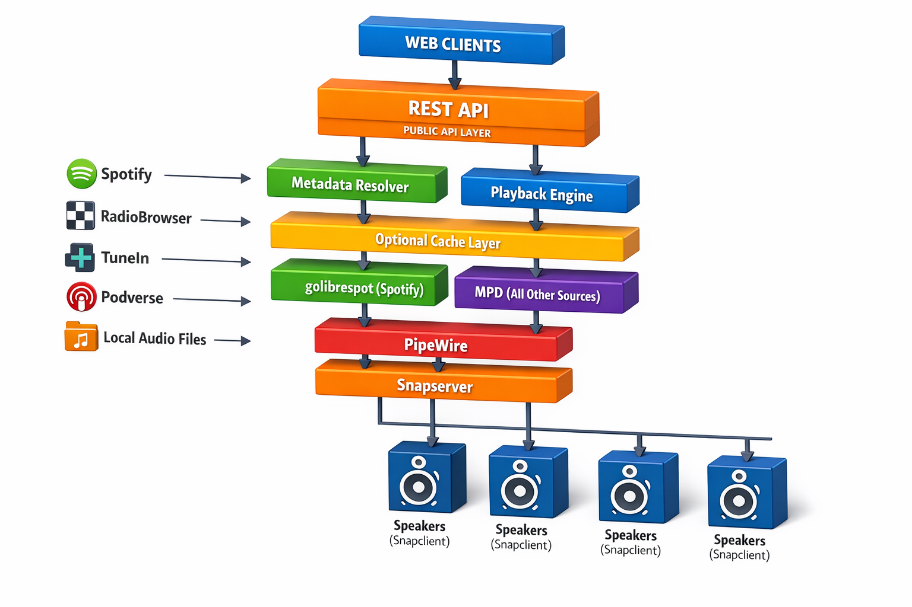

# VIOX Orchestration

VIOX is a modular, premium music server and player designed for clarity, determinism, and a glassy, touch‑friendly user experience. It combines a strongly typed backend, a composable UI architecture, and a deterministic audio pipeline built for modern playback systems.

VIOX Orchestration is a series of configurations, scripts and Docker Compose files to assist you in setting up your own VIOX Muic system with
[VIOX Music Server](https://github.com/guidcruncher/viox-musicserver) and [VIOX Midnight Client](https://github.com/guidcruncher/viox-midnightclient).

## Features

### Music Playback
- Backend-driven commercial playback pipeline
- Multi~speaker audio support via PipeWire, Snapcast and WirePlumber
- Modular routing architecture for advanced audio setups

### Modular UI
- REST API Powered for multi-client support
- Glassy, minimal, rounded interface
- Touch-friendly equalizer and controls

### Metadata and Integrations
- Strongly typed media pipeline
- Maintained string-similarity matching for metadata normalization
- Unified mapping layer for external sources such as TuneIn

### Backend Architecture
- Node.js server with explicit configuration management
- Environment and file-based overrides

## Architecture

